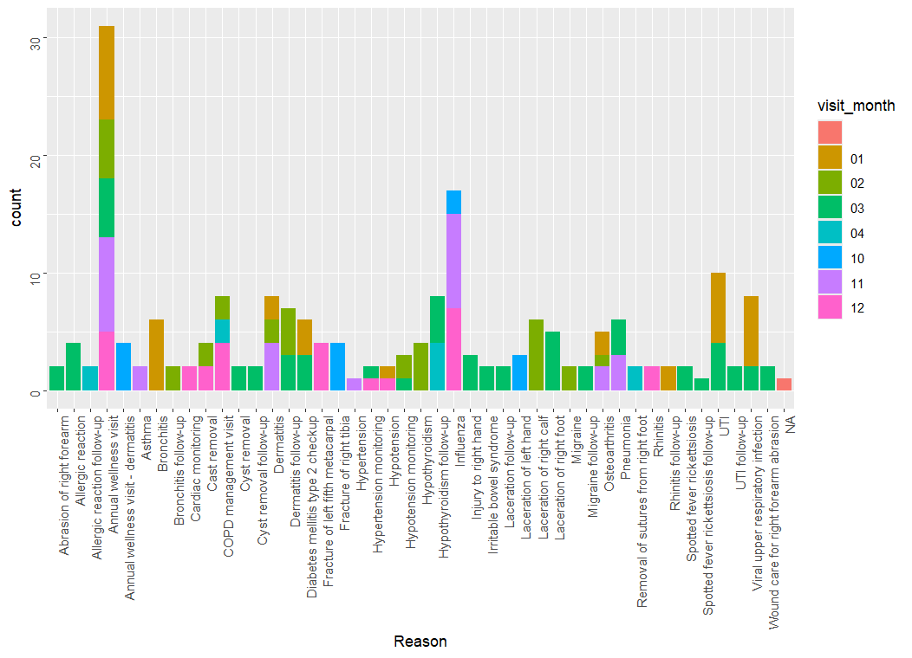
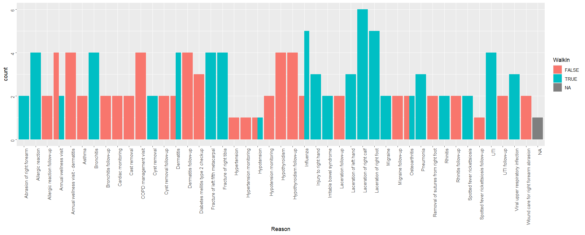
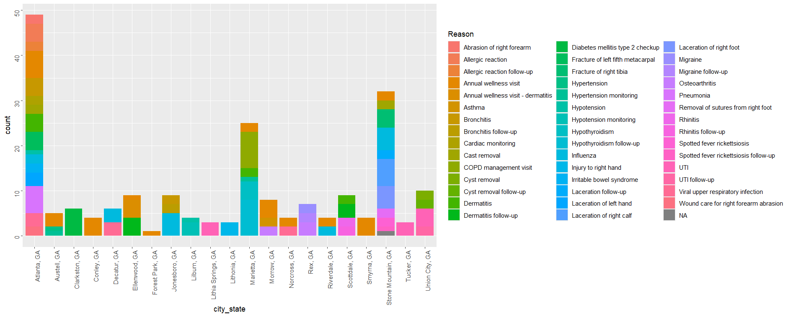
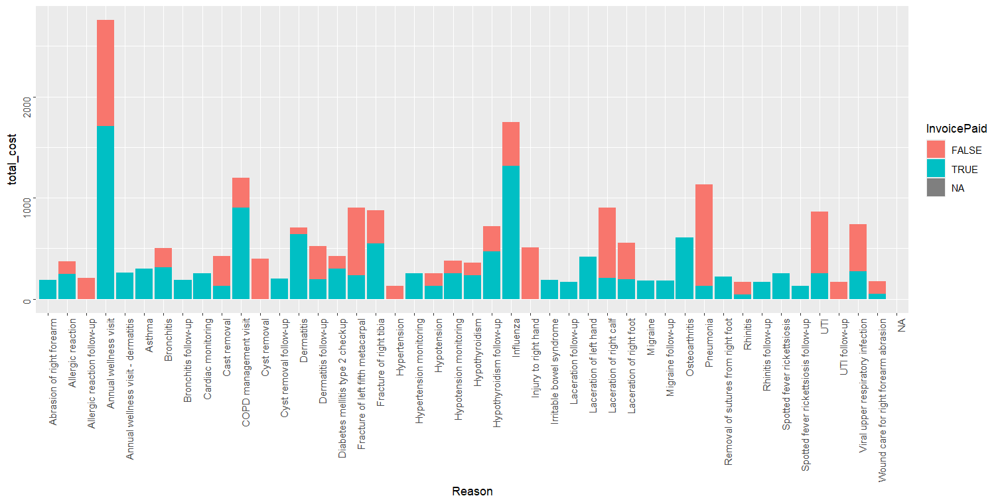
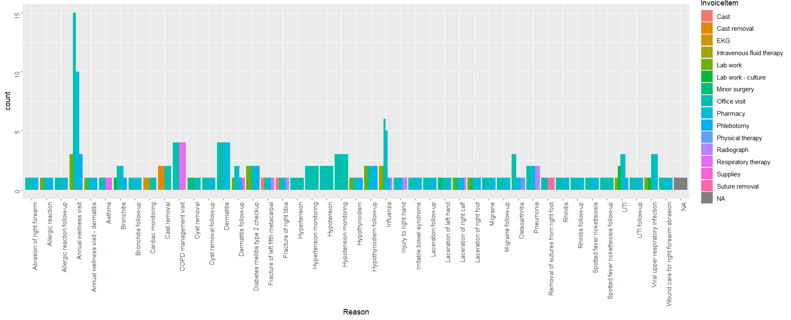

# DATA332_Patient_Repo
## Reason for visit by month of the year

  
  
As can be seen above non seasonal issues such as the wellness check serve as a baseline and are fairly even from month to month, while traditionally seasonal health issues such as the flu are most apparent in its traditional seasonal range, however it is interesting that the the later part of the traditonal flu season range (october to april peaking in december to february). According to this data all UTI cases appear in January and March so UTI prevention and awareness programs rolled out in late december early January and in late Februarary early March may be effective.

## Walk Ins by Visit Reason

  
  
As can be seen above most first time appointments for an incident or sickness apear to be walk-ins while follow up appoitnments such as follow ups, cast removals, and monitoring are almost always scheduled by appointment as expected.

## Reasons for visit by City, State

  
  
As can be seen above most pf the visits are happening in Atlanta, Georgia which is expected as it is the largest urban center on the list. Marietta, Georgia also having a high number of visits is expected as the second largest city on the list. The only abnormality is Stone Mountain, Georgia, an examination into the reasons and their prevention could be useful (most visits appear to be for physcial injuries which would track with this being near a state park).

## Total Cost and Amount of Cost Paid by Visit Reason

  
  
As can be seen the invoice paid to not paid appears to be balanced for most visit reasons, however programs increasing accessibilty or decreasing cost of UTI and Pnuemonia care may be neccessary in the regions covered by this data.

## Visit Reasons by Invoice Item

  
  
As can be seen above the invoice items to reason generally match, however the annual wellness check having such a high amount of things other than office visits being on the invoice serves as a representative example as to why the annual wellness check is important, due to these invoice items signifying that the wellness visit is causing actual health disoveries requiring money to be spent on services other than just the standard office visit.

